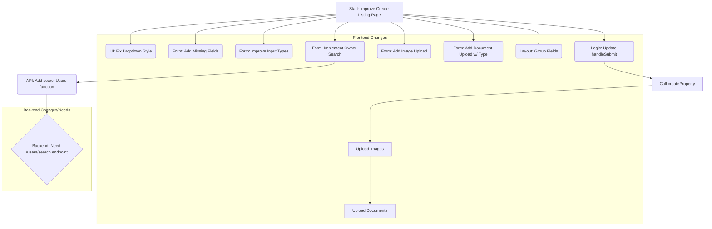

# Plan: Improve "Create New Listing" Page

This plan outlines the steps to enhance the `frontend/src/pages/CreateListingPage.jsx` component based on analysis and user feedback.

**Goal:** Improve usability, add missing core features, and fix UI issues.

**Phase 1: Initial Improvements**

1.  **UI Fix - Dropdown Style:**
    *   **File:** `frontend/src/pages/FormStyles.css`
    *   **Action:** Add a CSS rule for `select option` to set explicit, readable `background-color` and `color` values (e.g., light background, dark text).
2.  **Add Missing Fields & Improve Input Types:**
    *   **File:** `frontend/src/pages/CreateListingPage.jsx`
    *   **Action:** Add state and JSX elements for:
        *   Price (`price`, type `number`)
        *   Pricing Type (`pricing_type`, `<select>` populated with `FOR_SALE`, `RENTAL_MONTHLY`, `RENTAL_WEEKLY`, `RENTAL_DAILY`, `RENTAL_CUSTOM`)
        *   Square Feet (`square_feet`, type `number`)
        *   City (`city`, type `text`)
        *   Address (`address`, type `text`)
    *   **Action:** Change existing Bedrooms (`bedrooms`) and Bathrooms (`bathrooms`) inputs to `type="number"`.
3.  **Implement Owner Search:**
    *   **File:** `frontend/src/pages/CreateListingPage.jsx`
    *   **Action:** Add a text input ("Search Owner by Email/Name"). Implement state and logic to call a *new* `apiService.searchUsers` function (requires backend `/users/search?q=...`). Display search results and store the selected owner's ID (`owner_id`) in the form state.
4.  **Implement Basic Image Upload:**
    *   **File:** `frontend/src/pages/CreateListingPage.jsx`
    *   **Action:** Add `<input type="file" multiple accept="image/*">`. Store selected files in component state.
5.  **Implement Verification Document Upload:**
    *   **File:** `frontend/src/pages/CreateListingPage.jsx`
    *   **Action:** Add a section allowing multiple document uploads. For each upload instance, include `<input type="file">` and a `<select>` for `document_type` (populated with `PROOF_OF_OWNERSHIP`, `LISTER_IDENTIFICATION`, `OTHER`). Store selected files and their chosen types in component state.
6.  **Update Form Submission Logic:**
    *   **File:** `frontend/src/pages/CreateListingPage.jsx`
    *   **Action:** Modify the `handleSubmit` function to:
        *   Gather all form data, including the selected `owner_id`.
        *   Call `apiService.createProperty`.
        *   If successful, get the new `propertyId` from the response.
        *   Sequentially call `apiService.uploadPropertyImage` for each selected image file, passing the `propertyId`.
        *   Sequentially call `apiService.uploadVerificationDocument` for each selected document file, passing the `propertyId`, file, and selected `document_type`.
        *   Handle potential errors during uploads.
7.  **Basic Layout Grouping:**
    *   **File:** `frontend/src/pages/CreateListingPage.jsx`
    *   **Action:** Use headings (`<h2>`/`<h3>`) or `<fieldset>` tags with `<legend>` to structure the form into logical sections (e.g., Property Details, Location, Pricing & Specs, Owner, Images, Verification Documents).

**Diagram:**

**Dependencies:**

*   Requires a backend endpoint `/users/search?q=...` for the owner search functionality.