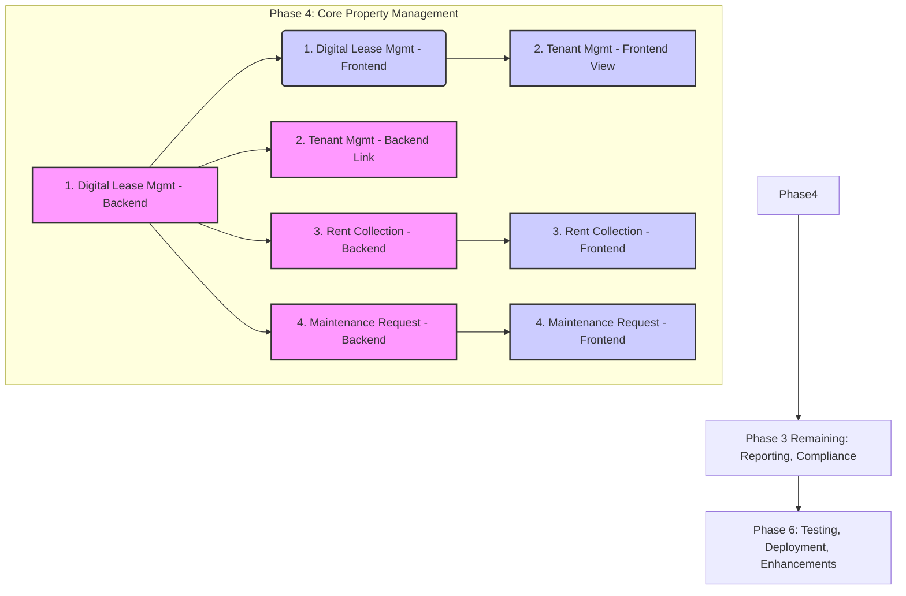

# Plan: Implement Phase 4 - Core Property Management Tools

This phase will be broken down into the following key features, implemented sequentially for both backend and frontend:

1.  **Digital Lease Management:**
    *   **Backend (`api/`):**
        *   Define `Lease` SQLAlchemy model (linking `property_id`, `tenant_id`, `landlord_id`, dates, rent details, status).
        *   Define `LeaseAgreementTemplate` model (for potential future use).
        *   Generate and apply Alembic migration(s).
        *   Implement `LeaseService` for CRUD operations.
        *   Define Pydantic schemas for API requests/responses.
        *   Create API endpoints (`lease_routes.py`) for managing leases (create, view, update, list for landlord/tenant). Register blueprint in `app.py`.
    *   **Frontend (`frontend/`):**
        *   Create `ManageLeasesPage.jsx` for landlords to list/add leases.
        *   Create a `LeaseForm.jsx` component.
        *   Add necessary routes in `App.jsx`.
        *   Implement API service calls in `apiService.jsx`.
        *   Add a section/view in the tenant's dashboard to display their lease(s).

2.  **Tenant Management (Implicit):**
    *   This is largely covered by linking Users (tenants, landlords) within the `Lease` model. Frontend views created in step 1 will display tenant information associated with leases.

3.  **Rent Collection & Tracking:**
    *   **Backend (`api/`):**
        *   Define `RentPayment` SQLAlchemy model (linking to `Lease`, tracking amounts, dates, status, payment method).
        *   Generate and apply Alembic migration.
        *   Implement `PaymentService` (or extend `LeaseService`) to:
            *   Generate expected payment records based on lease terms.
            *   Record manual payments (e.g., cash, bank transfer).
            *   *(Deferred Sub-task):* Integrate with Mobile Money APIs (MTN MoMo, Orange Money) - Requires separate research and implementation effort.*
        *   Define Pydantic schemas.
        *   Create API endpoints for landlords (view status, record payments) and tenants (view history/due payments).
    *   **Frontend (`frontend/`):**
        *   Enhance `ManageLeasesPage.jsx` (or create `RentDashboardPage.jsx`) for landlords to view payment statuses and record manual payments.
        *   Enhance the tenant dashboard to show payment history and upcoming dues.
        *   *(Deferred Sub-task):* Add "Pay Rent" button integration once Mobile Money backend is complete.*
    *   **Backend (Basic Reminders):** Implement logic (e.g., a scheduled task or check on login) to update payment statuses to `OVERDUE`. Actual notifications will be part of Phase 6.

4.  **Maintenance Request Management:**
    *   **Backend (`api/`):**
        *   Define `MaintenanceRequest` SQLAlchemy model (linking property, tenant, description, status, optional photo).
        *   Generate and apply Alembic migration.
        *   Implement `MaintenanceService` for CRUD operations.
        *   Define Pydantic schemas.
        *   Create API endpoints (`maintenance_routes.py`) for tenants (submit, view) and landlords (view, update status). Register blueprint.
    *   **Frontend (`frontend/`):**
        *   Add a section/form in the tenant dashboard for submitting new requests and viewing existing ones.
        *   Create `MaintenanceDashboardPage.jsx` for landlords to view and manage requests for their properties.
        *   Implement API service calls.

**Visual Plan (Mermaid Diagram):**

This plan focuses on delivering the core property management features identified as a priority. Once Phase 4 is complete, we can proceed to the remaining tasks in Phase 3 (Reporting System, Compliance) and then move on to Phase 6 (Testing, Deployment, Enhancements).